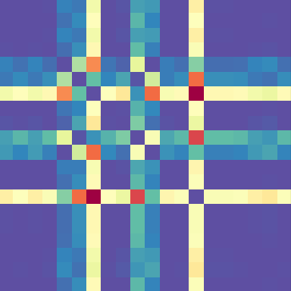
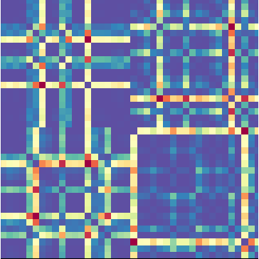

# **FIORENZO PARASCANDALO, DANIELE DOMENICHELLI - UNIBO**
## **MACHINE LEARNING FOR COMPUTER VISION - PROJECT:**
## *Deep Learning approaches for Financial Forecasting*

### **Target:**
Develop of a machine learning algorithm for financial forecasting,
exploiting Gramian Angular (Difference/Sum) Field (GADF/GASF) encoding
and reinforcement learning techniques.

### **Details:**
The algorithm is responsible to output the trading action:
- a **Long Action**, which consists of buying the stock, and then selling it before the market
closes
- a **Short Action**, which consists of selling the stock (using the mechanism of the uncovered sale), and then buying it before the market closes
- a **Hold Action**, which consists of deciding not to invest in that day

The respective labels for these different actions are:
- **Long Action (1)**, if `Close − Open > 0`
- **ShortAction (0)**, otherwise

The ensemble, through a majority voting system or a reinforcment learning based approach, can decide
which action to take, and eventually take no action at all (**Hold Action**) if the conditions are not
suitable.

### **Approach:**
Our approach to predict the Stock Market Trend is inspired by the [work of Barra (UNINA)](https://www.iris.unina.it/retrieve/handle/11588/807057/337910/IEEE_CAA_Journal_of_Automatica_Sinica-3.pdf). He
used an ensemble of CNNs over GAF images (particularly, the GADF). The data of the original time series are aggregated according to 4 intervals of time; then, consecutive time frames of 20 observations are extracted from each time series, in order to generate the related set of GADF images. Twenty similar CNNs are trained over these images, and the threshold-driven ensemble approach takes place for deciding which action to perform the day after the observations. We have proposed a different architecture for the ensemble and a deep reinforcment learning method to encapsulate the policy.

### **Time Aggregation:**
The minimum period that we can use to represent the samples of our dataset is equal to 1 day since this
is the minimum period that elapses between two consecutive samples. However, in order to obtain a more
generic and _"looking more backward"_ representation, we decided to create 3 more GASF/GADF images for
each sample using different time periods. The first has a daily granularity, while the others have an
increasing granularity (2, 3, 5 days).

### **Results:**

| Architecture                     | Accuracy (%) | Coverage (%) | Starting Wallet | Final Wallet |
|:---------------------------------|:------------:|:------------:|:---------------:|:------------:|
| VGG                              | 54.33        | 84.47        | 100             | 2129         |
| VGG_Rhombus                      | 54.36        | 81.80        | 100             | 2109         |
| VGG_DQN                          | 55.19        | 39.86        | 100             | 1201         |
| ResNet_Stem-1                    | 54.58        | 84.47        | 100             | 2323         |
| ResNet_Stem-2                    | 54.78        | 81.27        | 100             | 2392         |
| ResNet_Stem-2-NonLocal           | 54.97        | 82.57        | 100             | 2449         |
| ResNet_Stem-2-NonLocal_Rhombus   | 54.31        | 84.96        | 100             | 2202         |
| ResNet_Stem-2-NonLocal_DQN       | 55.59        | 62.71        | 100             | 2002         |